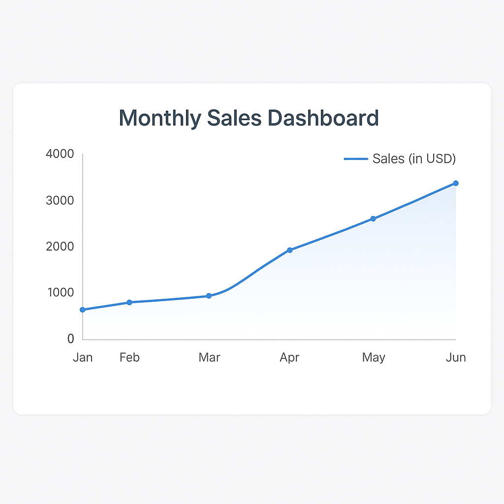

# 📊 Dashboard with Chart.js

A simple responsive dashboard showing monthly sales data using **Chart.js** and **JavaScript**.

## 🔧 Tech Stack
- HTML, CSS, JavaScript
- Chart.js (via CDN)
- Static JSON data (can be connected to SQL later)

## 🎯 Features
- Clean responsive UI
- Line chart showing monthly sales
- Easy to customize for expenses, visitors, etc.

## 🗂 Folder Structure
├── index.html
├── style.css
├── script.js
└── data.json

## 🖥️ Dashboar Preview

## 🚀 How to Run
1. Clone this repo
2. Open `index.html` in your browser
3. You’ll see the dashboard with Chart.js chart

## 📌 Freelance Use
Great for admin dashboards, analytics widgets, and reporting UIs for small business or SaaS clients.